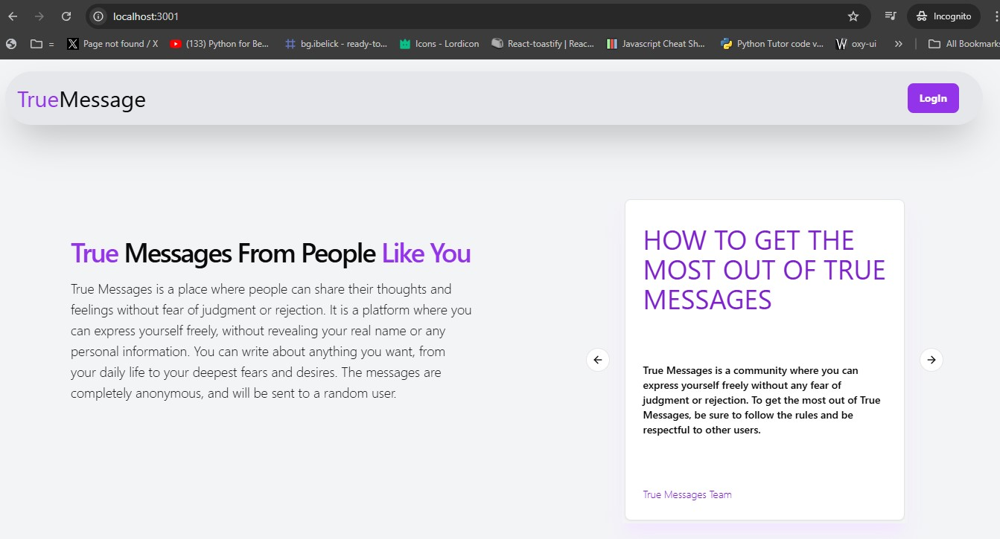

## Introduction to TRUE-FEEDBACK Application
Welcome to our innovative application designed to empower every user by providing a platform for valuable feedback and suggestions. Whether you're a long-time user or just starting your insights and ideas are crucial to our continuous improvement. This application is dedicated to creating a collaborative environment where every voice matters, ensuring that we meet and exceed your expectations. Join us in shaping the future of our services, as your feedback directly influences the development and enhancement of features that matter most to you.

<<<<<<< HEAD





## Clone Repositry
=======
## Clone Repository
>>>>>>> a62356efa193d8a41d3d7209d9ccda129225f7bb
```bash
git clone https://github.com/MANI-WEBDEVE/True-FeedBack-app.git
```

## Install And Run
```bash
npm install
nm run dev
```

## Uses Technologies
[Next.js](https://nextjs.org)

[TailwindCss](https://nextjs.org/)

[Next-Auth](#)

[Zod](https://zod.dev/)

[Mongoose](https://mongoosejs.com/)

[React-Email](https://react.email/)

[Resend](https://resend.com/emails)

[Bcrypt js](https://nextjs.org/)

[React-email Components](#)

## Contributing
Contributions are welcome, so you can make a pull request with your enhancements.
